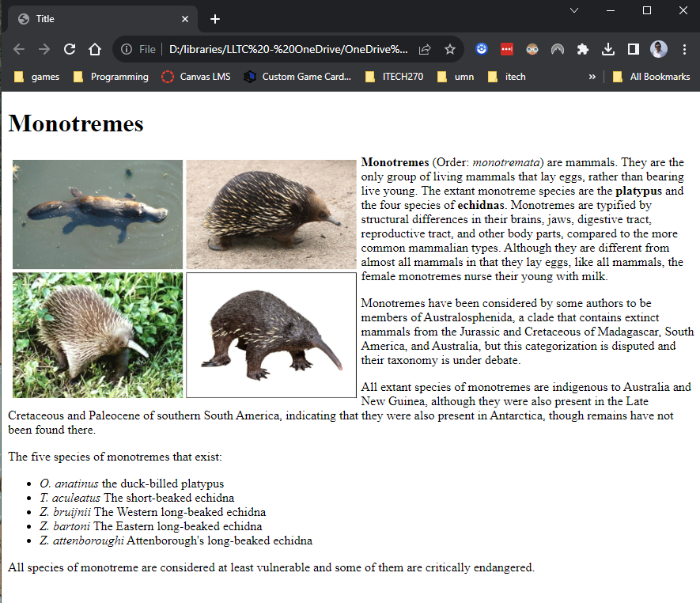

# Lab 1

In this homework, you are to, as closely as possible, recreate the webpage in this image:

You are supplied with a file `index.html` which contains a basic HTML skeleton with standard elements and a doctype declaration. Use this skeleton as you see fit. Deleting placeholder content and adding your own as needed.

Do not worry about making mistakes. In fact, we have _not_ covered everything you need to recreate this page exactly. Instead, think about all of the things that you are not able to recreate and list them. Then we'll discuss this in the next class.

Feel free to explore other sources of information. Refer to the slides and other materials on Canvas as needed. It is also a good idea to check out the resources at [w3schools](http://www.w3schools.com).

Also, using a search engine (ie, Google) can be useful as well.

As you grow in skill, you will find other resources to learn from.
